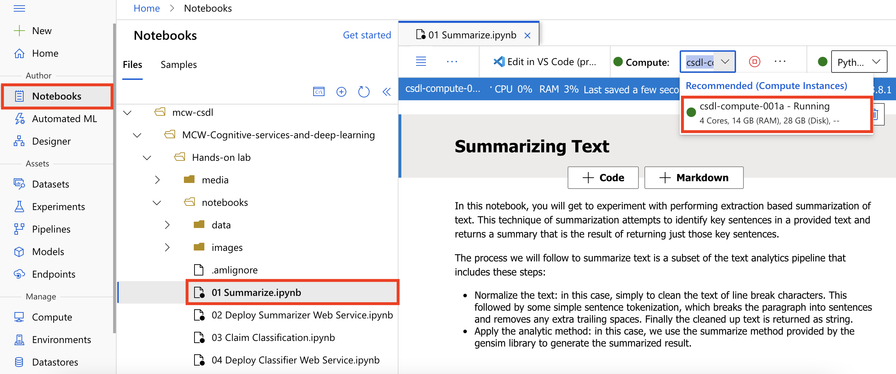
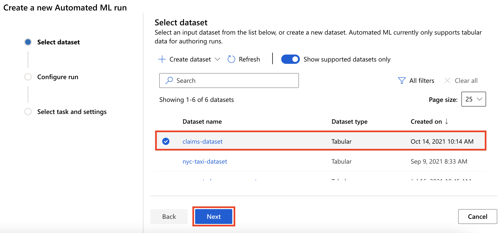
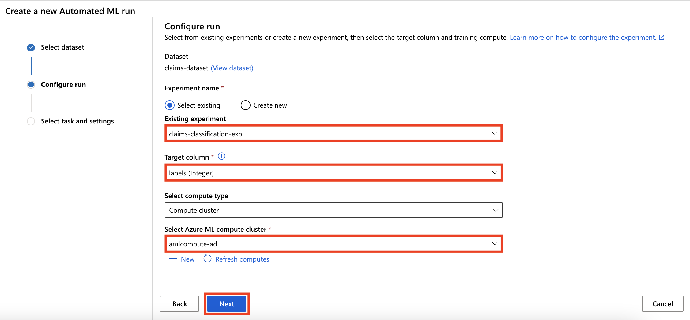
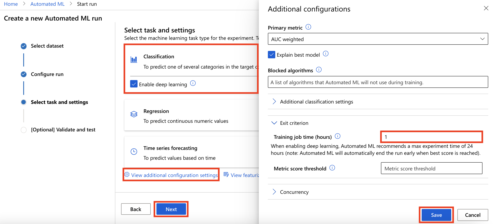
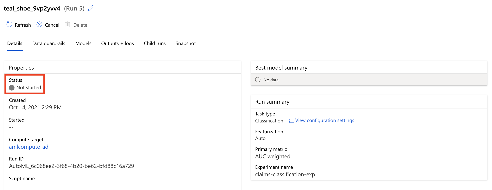
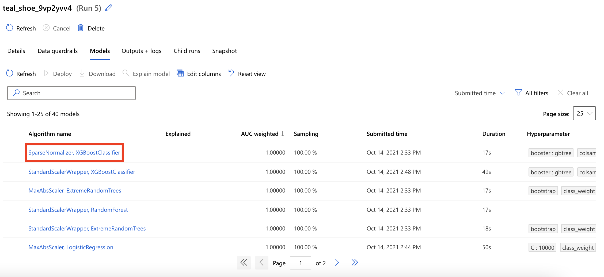
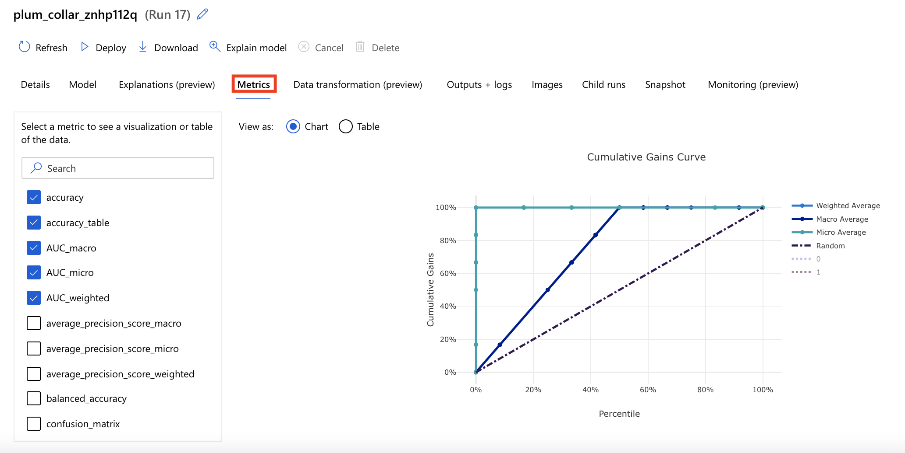

## Exercise 1: Create and deploy a Summarization Service

Duration: 60 minutes

In this exercise, you create and deploy a web service that uses a pre-trained model to summarize long text paragraphs.

### Task 1: Locate and open the summarization notebook

In this task, you will navigate to the folder where all the notebooks for this lab are available. Then you will open the `Summarization` notebook and confirm that the compute instance is attached to the notebook.

1. From within Azure Machine Learning studio, navigate to the `Notebooks` section by selecting it from the left-hand navigation menu. Then select the notebook: **mcw-csdl/MCW-Analyzing-text-with-azure-machine-learning-and-cognitive-services/Hands-on lab/notebooks/01 Summarize.ipynb**. From the toolbar select **Compute** and confirm that the compute instance created in `Before the HOL - Analyzing text with Azure Machine Learning and Cognitive Services` is selected and is in running state.

    

### Task 2: Run notebook - 01 Summarize

1. Read the instructions at the top of the notebook and execute the notebook cells one by one by selecting the **Run cell** arrow.

    

### Task 3: Run notebook - 02 Deploy Summarizer Web Service

1. Within the `notebooks` folder, select the notebook called **02 Deploy Summarizer Web Service.ipynb**. This opens the notebook so you can read and execute the code it contains.

2. Read the instructions at the top of the notebook, and execute the cells as instructed.

3. Make sure you copy the scoring URI from the output of the last cell of this notebook. The scoring URI value is needed in the final notebook of this hands-on lab.

## Exercise 2: Create and deploy a custom Deep Learning Model using Keras

Duration: 60 minutes

In this exercise, you use Keras to construct and train a Deep Neural Network (DNN) called the Long Short-Term Memory (LSTM) recurrent neural network. LSTM works well for text classification problems, especially when used in conjunction with word embedding such as GloVe for word vectorization. In this notebook, you also learn how GloVe word embeddings perform on word analogy tasks.

### Task 1: Run notebook - 03 Claim Classification

1. Within the `notebooks` folder, select the notebook named **03 Claim Classification.ipynb**. This opens the notebook so you can read and execute the code it contains.

2. Read the instructions at the top of the notebook, and execute the cells as instructed.

   > **Note**: Pay attention to the top of the notebook and check the TensorFlow library version. The TensorFlow version should be 2.2.0.

### Task 2: Run notebook - 04 Deploy Classifier Web Service

1. Within the `notebooks` folder, select the notebook named **04 Deploy Classifier Web Service.ipynb**. This opens the notebook so you can read and execute the code it contains.

2. Read the instructions at the top of the notebook, and execute the cells as instructed.

3. Make sure you copy the scoring URI from the output of the last cell of this notebook. The scoring URI value is needed in the final notebook of this hands-on lab.

## Exercise 3: Text classification with Azure Automated Machine Learning

Duration: 75 minutes

Automated machine learning picks an algorithm and hyperparameters for you and generates a model ready for deployment. You can create and run automated machine learning experiments in code using the [Azure ML Python SDK](https://docs.microsoft.com/en-us/azure/machine-learning/service/how-to-configure-auto-train) or if you prefer a no code experience, you can also Create your automated machine learning experiments in the [Azure portal](https://docs.microsoft.com/en-us/azure/machine-learning/service/how-to-create-portal-experiments).

In this exercise, you learn how to create, run, and explore automated machine learning experiments in the Azure portal without a single line of code. We will train a classification model for claim text that will predict `1` if the claim is an auto insurance claim or `0` if it is a home insurance claim.

> **Note**: You need to complete running the notebook **03 Claim Classification.ipynb** from `Exercise 2 Task 1` before starting this exercise.

### Task 1: Create new automated ML experiment

1. From within Azure Machine Learning studio, select **Home, Create new, Automated ML run**.

   

1. This will open a `Create a new Automated ML run` page.

### Task 2: Create a new automated ML run

1. Select the dataset **claims-dataset** created during `Exercise 2` and then select **Next**.

  

2. In the `Configure run` page, make the following selections, and then select **Next**:

   - Existing experiment: **claims-classification-exp**
   - Target column: **labels (Integer)**
   - Select Azure ML compute cluster: **amlcompute-ad**

  

3. In the `Select task type` page make the following selections, and then open the `Additional configurations` dialog by selecting **View additional configuration settings**:

   - Task type: **Classification**
   - Enable deep learning: **Checked**

4. In the `Additional configurations` dialog make the following selections and then select **Save**:

   - Training job timeout (hours): **1**
   - Validation type: **Train-validation split**
   - Percentage validation of data: **10**

5. In the `Select task type` page select **Finish** to start the AutoML experiment run.

  

### Task 3: Monitor automated ML run

1. You can monitor the experiment from the run details page. Initially run status is `Not started`. Wait till the run status is `Completed`.

  

> **Note**: The Automated ML run will for around 40-60 minutes. It is recommended you complete Exercise 4 and then return to complete Exercise 3.

### Task 4: Review best model performance

1. Select the **Models** tab to review the model pipelines that were trained during the experiment run.

  

1. Select the **algorithm** with the best score on the primary metric `AUC weighted`.

  

1. Select the **Metrics** tab to review the various performance metrics and charts.

  

  > **Note**: You have the option to deploy the trained model pipeline to either Azure Container Instance or Azure Kubernetes Service directly from the Azure ML Studio.

## Exercise 4: Completing the solution

Duration: 45 minutes

In this exercise, you perform the final integration with the Text Analytics APIs and the Azure Machine Learning service you previously deployed to deliver the completed proof of concept solution.

### Task 1: Retrieve the Text Analytics API endpoint and key

In this task, you will retrieve the API key and endpoint URI associated with your Text Analytics API.

1. In the [Azure portal](https://portal.azure.com), select **Resource groups** from the Azure services list.

   

2. Select the `hands-on-lab-SUFFIX` resource group you created for this hands-on lab from the list of resource groups.

    

3. Select your Text Analytics Cognitive Services resource from the list.

    

4. Select **Keys and Endpoint** from the left-hand navigation menu and then copy the **Key 1** and **Endpoint** values into a text editor, such as Notepad.exe, or something similar as you will need this value later in this exercise.

    

### Task 2: Run notebook - 05 Cognitive Services

1. From within Azure Machine Learning Studio, navigate to the `Notebooks` section by selecting it from the left-hand navigation menu. Then select the notebook: **mcw-csdl/MCW-Analyzing-text-with-azure-machine-learning-and-cognitive-services/Hands-on lab/notebooks/05 Cognitive Services.ipynb**. This opens the notebook so you can read and execute the code it contains.

2. Follow the steps within the notebook to complete the lab and view the result of combining Cognitive Services with your Azure Machine Learning Services.

## After the hands-on lab

Duration: 5 minutes

To avoid unexpected charges, it is recommended that you clean up all your lab resources when you complete the lab.

### Task 1: Clean up lab resources

1. In the [Azure portal](https://portal.azure.com), select **Resource groups** from the Azure services list.

   

2. Select the `hands-on-lab-SUFFIX` resource group you created for this hands-on lab from the list of resource groups.

    

3. Select **Delete resource group** from the command bar.

    

4. In the confirmation dialog that appears, enter the name of the resource group, and select **Delete**.

5. Wait for confirmation the Resource Group has been successfully deleted. If you don't wait, and the delete fails for some reason, you may be left with resources running that were not expected. You can monitor using the Notifications dialog, which is accessible from the Alarm icon.

    

6. When the Notification indicates success, the cleanup is complete.

You should follow all steps provided _after_ attending the Hands-on lab.
