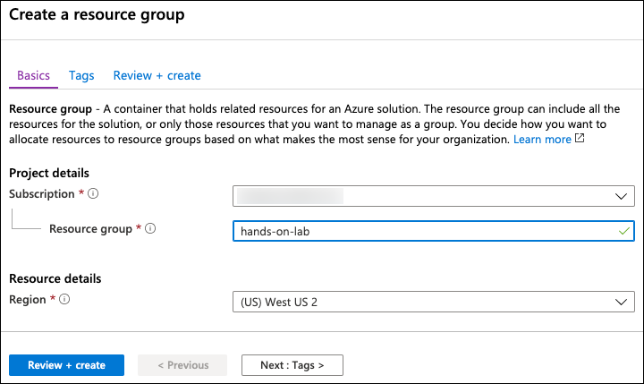
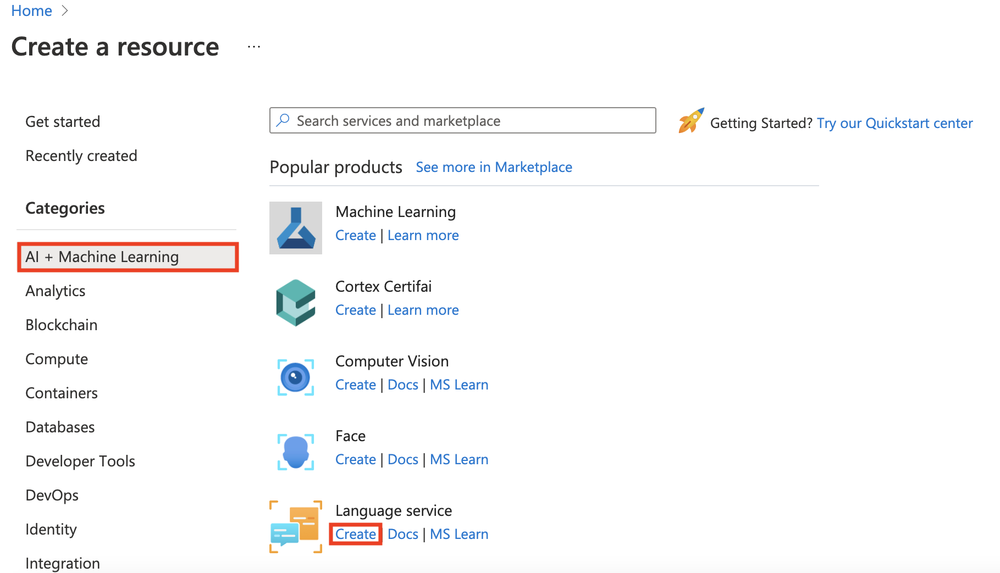
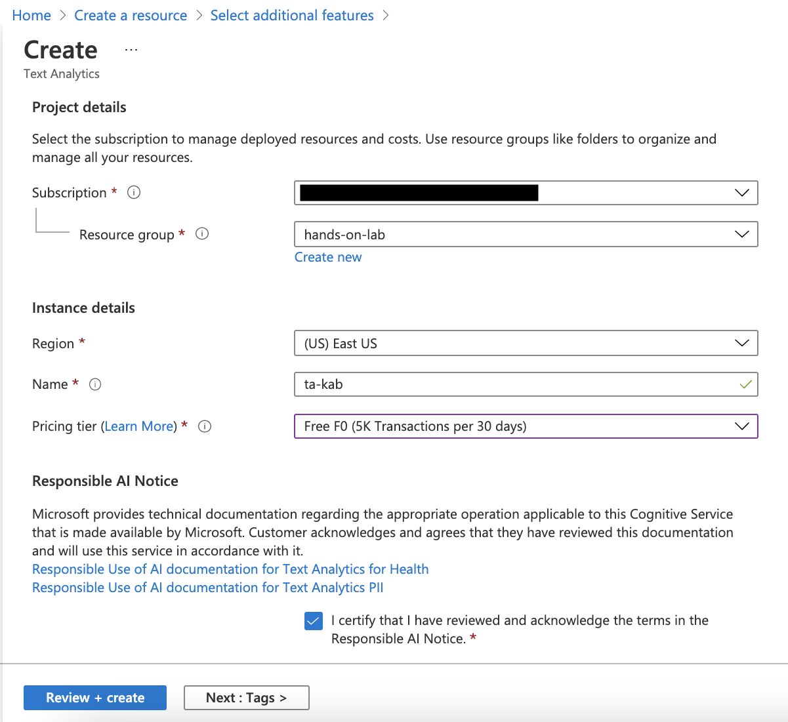
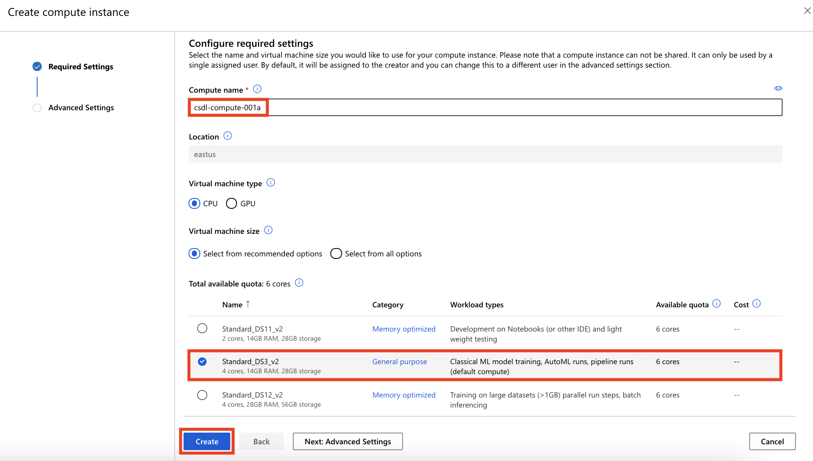

Analyzing text with Azure Machine Learning and Cognitive Services

Before the hands-on lab setup guide

November 2021

Information in this document, including URL and other Internet Web site references, is subject to change without notice. Unless otherwise noted, the example companies, organizations, products, domain names, e-mail addresses, logos, people, places, and events depicted herein are fictitious, and no association with any real company, organization, product, domain name, e-mail address, logo, person, place or event is intended or should be inferred. Complying with all applicable copyright laws is the responsibility of the user. Without limiting the rights under copyright, no part of this document may be reproduced, stored in or introduced into a retrieval system, or transmitted in any form or by any means (electronic, mechanical, photocopying, recording, or otherwise), or for any purpose, without the express written permission of Microsoft Corporation.

Microsoft may have patents, patent applications, trademarks, copyrights, or other intellectual property rights covering subject matter in this document. Except as expressly provided in any written license agreement from Microsoft, the furnishing of this document does not give you any license to these patents, trademarks, copyrights, or other intellectual property.

The names of manufacturers, products, or URLs are provided for informational purposes only and Microsoft makes no representations and warranties, either expressed, implied, or statutory, regarding these manufacturers or the use of the products with any Microsoft technologies. The inclusion of a manufacturer or product does not imply endorsement of Microsoft of the manufacturer or product. Links may be provided to third party sites. Such sites are not under the control of Microsoft and Microsoft is not responsible for the contents of any linked site or any link contained in a linked site, or any changes or updates to such sites. Microsoft is not responsible for webcasting or any other form of transmission received from any linked site. Microsoft is providing these links to you only as a convenience, and the inclusion of any link does not imply endorsement of Microsoft of the site or the products contained therein.

© 2021 Microsoft Corporation. All rights reserved.

Microsoft and the trademarks listed at <https://www.microsoft.com/en-us/legal/intellectualproperty/Trademarks/Usage/General.aspx> are trademarks of the Microsoft group of companies. All other trademarks are property of their respective owners.

**Contents**

<!-- TOC -->

- [Analyzing text with Azure Machine Learning and Cognitive Services before the hands-on lab setup guide](#analyzing-text-with-azure-machine-learning-and-cognitive-services-before-the-hands-on-lab-setup-guide)
  - [Requirements](#requirements)
  - [Before the hands-on lab](#before-the-hands-on-lab)
    - [Task 1: Create a resource group](#task-1-create-a-resource-group)
    - [Task 2: Provision a Text Analytics API](#task-2-provision-a-text-analytics-api)
    - [Task 3: Create an Azure Machine Learning workspace](#task-3-create-an-azure-machine-learning-workspace)
    - [Task 4: Create a Compute instance](#task-4-create-a-compute-instance)
    - [Task 5: Import the lab notebooks](#task-5-import-the-lab-notebooks)
    - [Task 6: Setup lab environment](#task-6-setup-lab-environment)

<!-- /TOC -->

# Analyzing text with Azure Machine Learning and Cognitive Services before the hands-on lab setup guide

## Requirements

1. You will need an Azure subscription with permissions to deploy resource groups and resources into them.

   - Trial subscriptions will not work. You will run into issues with Azure resource quota limits.
   - Subscriptions with access limited to a single resource group will not work. You need the ability to deploy multiple resource groups.

## Before the hands-on lab

Duration: 25 minutes

In this exercise, you set up your environment for use in the rest of the hands-on lab. You should follow all steps provided _before_ attending the Hands-on lab.

> **Important**: Many Azure resources require globally unique names. Throughout these steps, the word "SUFFIX" appears as part of resource names. You should replace this with your Microsoft alias, initials, or other value to ensure uniquely named resources.

### Task 1: Create a resource group

1. In the [Azure portal](https://portal.azure.com), select **Resource groups** from the Azure services list.

   

2. On the Resource groups blade, select **+Add**.

   

3. On the Create a resource group **Basics** tab, enter the following:

   - **Subscription**: Select the subscription you are using for this hands-on lab.
   - **Resource group**: Enter `hands-on-lab-SUFFIX` as the name of the new resource group, where SUFFIX is your Microsoft alias, initials, or other value to ensure uniquely named resources.
   - **Region**: Select the region you are using for this hands-on lab.

   

4. Select **Review + Create**.

5. On the **Review + create** tab, ensure the Validation passed message is displayed and then select **Create**.

### Task 2: Provision a Text Analytics API

In this task, you create a Text Analytics API, which will be integrated into your final POC.

1. In the [Azure portal](https://portal.azure.com/), select the **Show portal menu** icon and then choose **+Create a resource** from the menu.

   

2. Select **AI + Machine Learning** in the Azure Marketplace list and then select **Text Analytics** from the featured services list.

    

   > **Note**: If you are shown the `Select additional features` page, select **Skip this step**.

3. On the **Create** tab, provide the following:

    Project details:

    - **Subscription**: Select the subscription you are using for this hands-on lab.
    - **Resource group**: Select the hands-on-lab-SUFFIX resource group from the dropdown list.

    Instance Details:

    - **Region**: Select the region you used for the hands-on-lab-SUFFIX resource group.
    - **Name:** Provide a unique name for this instance, such as ta-SUFFIX.
    - **Pricing tier**: Free F0 (5K Transactions per 30 days).
    - **Responsible AI Notice**: Checked

    

4. Select **Review + create**.

5. Ensure validation passes and then select **Create** on the Review + create tab.

### Task 3: Create an Azure Machine Learning workspace

In this task, you provision the Azure Machine Learning workspace you will use throughout this hands-on lab.

1. Sign into [Azure portal](https://portal.azure.com) by using the credentials for your Azure subscription.

2. In the upper-left corner of the Azure portal, select **+ Create a resource**.

3. Use the search bar to find the **Machine Learning**.

4. Select **Machine Learning**.

5. In the **Machine Learning** pane, select **Create** to begin.

   

6. Provide the following information to configure your new workspace:

   - **Subscription**: Select the Azure subscription that you want to use.

   - **Resource group**: Use an existing resource group in your subscription or enter a name to create a new resource group. A resource group holds related resources for an Azure solution. In this example, we use **hands-on-lab**.

   - **Workspace name**: Enter a unique name that identifies your workspace. In this example, we use **ml-wksp**. Names must be unique across the resource group. Use a name that's easy to recall and to differentiate from workspaces created by others.

   - **Location**: Select the location closest to your users and the data resources to create your workspace.

   - **Container registry**: Use an existing container registry in your subscription or create a new container registry with `Standard SKU`.

   

7. After you are finished configuring the workspace, select **Review + Create**. Select **Create** after you review the fields you just entered.

    > **Note**: It can take several minutes to create your workspace in the cloud.

    When the process is finished, a deployment success message appears.

8. To view the new workspace, select **Go to resource**.

9. Navigate to the [Azure Machine Learning Studio](https://ml.azure.com) and select the workspace that you created or select **Launch now** under **Try the new Azure Machine Learning studio** in the **Overview** section of your Azure Machine Learning workspace.

   

### Task 4: Create a Compute instance

In this task, you add a compute resource to your Azure Machine Learning workspace.

1. In the new Azure Machine Learning studio window, select **Create new** and then select **Compute instance** from the context menu.

   

2. On the create compute instance screen, enter the following information:

   - **Compute name**: Enter csdl-compute-SUFFIX, where SUFFIX is your Microsoft alias, initials, or other value to ensure uniquely named resources.
   - **Virtual machine size**: Standard_DS3_v2

   

3. Select **Create** and wait for the Compute Instance to be ready. It takes approximately 3-5 minutes for the compute provisioning to complete.

### Task 5: Import the lab notebooks

In this task, you import Jupyter notebooks from GitHub that you will use to complete the exercises in this hands-on lab.

1. Select the Compute Instance, **csdl-compute-SUFFIX**, and then select **Jupyter** link to open Jupyter Notebooks interface.

   

2. Check **Yes, I understand** and select **Continue** in the trusted code dialog.

   

3. In the new Jupyter window, select **New** and then select **Terminal** from the context menu.

   
  
4. Run the following commands in order in the terminal window:

   - `mkdir mcw-csdl`
   - `cd mcw-csdl`
   - `git clone https://github.com/microsoft/MCW-Analyzing-text-with-azure-machine-learning-and-cognitive-services.git`

5. Wait for the `clone` command to finish importing the repo.

### Task 6: Setup lab environment

1. From the terminal window run the following commands (assuming you are in the `mcw-csdl` folder):

   - `cd "MCW-Analyzing-text-with-azure-machine-learning-and-cognitive-services/Hands-on lab/notebooks"`
   - `conda activate azureml_py38`
   - `pip install --upgrade pip`
   - `pip install -r requirements.txt`

    > Note: You can safely ignore any dependency errors during installation.

You should follow all these steps provided *before* attending the Hands-on lab.
