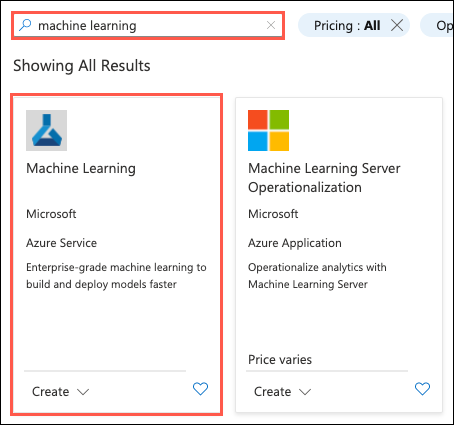
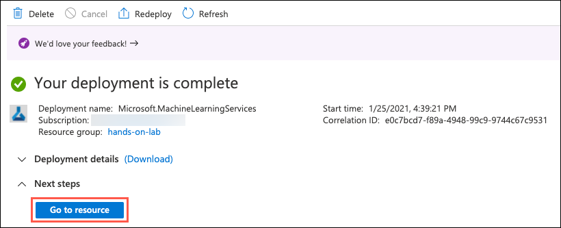
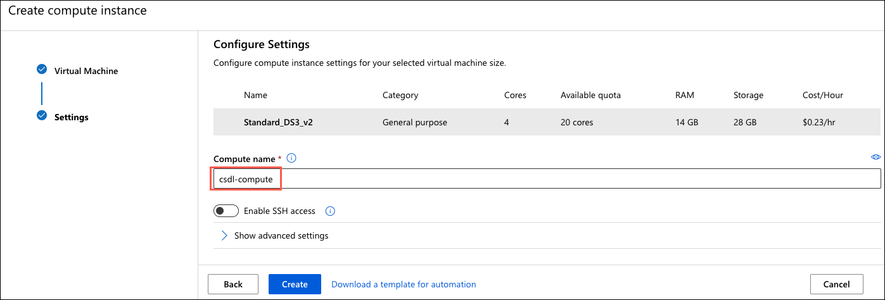
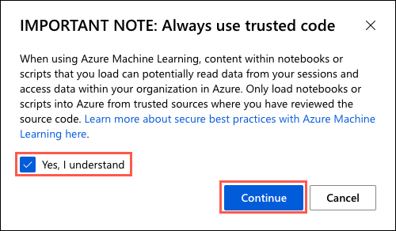

Cognitive services and deep learning

Before the hands-on lab setup guide

January 2021

Information in this document, including URL and other Internet Web site references, is subject to change without notice. Unless otherwise noted, the example companies, organizations, products, domain names, e-mail addresses, logos, people, places, and events depicted herein are fictitious, and no association with any real company, organization, product, domain name, e-mail address, logo, person, place or event is intended or should be inferred. Complying with all applicable copyright laws is the responsibility of the user. Without limiting the rights under copyright, no part of this document may be reproduced, stored in or introduced into a retrieval system, or transmitted in any form or by any means (electronic, mechanical, photocopying, recording, or otherwise), or for any purpose, without the express written permission of Microsoft Corporation.

Microsoft may have patents, patent applications, trademarks, copyrights, or other intellectual property rights covering subject matter in this document. Except as expressly provided in any written license agreement from Microsoft, the furnishing of this document does not give you any license to these patents, trademarks, copyrights, or other intellectual property.

The names of manufacturers, products, or URLs are provided for informational purposes only and Microsoft makes no representations and warranties, either expressed, implied, or statutory, regarding these manufacturers or the use of the products with any Microsoft technologies. The inclusion of a manufacturer or product does not imply endorsement of Microsoft of the manufacturer or product. Links may be provided to third party sites. Such sites are not under the control of Microsoft and Microsoft is not responsible for the contents of any linked site or any link contained in a linked site, or any changes or updates to such sites. Microsoft is not responsible for webcasting or any other form of transmission received from any linked site. Microsoft is providing these links to you only as a convenience, and the inclusion of any link does not imply endorsement of Microsoft of the site or the products contained therein.

© 2021 Microsoft Corporation. All rights reserved.

Microsoft and the trademarks listed at <https://www.microsoft.com/en-us/legal/intellectualproperty/Trademarks/Usage/General.aspx> are trademarks of the Microsoft group of companies. All other trademarks are property of their respective owners.

**Contents**

<!-- TOC -->

- [Cognitive services and deep learning before the hands-on lab setup guide](#cognitive-services-and-deep-learning-before-the-hands-on-lab-setup-guide)
  - [Requirements](#requirements)
  - [Before the hands-on lab](#before-the-hands-on-lab)
    - [Task 1: Create a resource group](#task-1-create-a-resource-group)
    - [Task 2: Create an Azure Machine Learning workspace](#task-2-create-an-azure-machine-learning-workspace)
    - [Task 3: Create a Compute Instance](#task-3-create-a-compute-instance)
    - [Task 4: Import the Lab Notebooks](#task-4-import-the-lab-notebooks)

<!-- /TOC -->

# Cognitive services and deep learning before the hands-on lab setup guide

## Requirements

1. Microsoft Azure subscription must be pay-as-you-go or MSDN

   - Trial subscriptions will not work. You will run into issues with Azure resource quota limits.
   - Subscriptions with access limited to a single resource group will not work. You need the ability to deploy multiple resource groups.

## Before the hands-on lab

Duration: 25 minutes

In this exercise, you set up your environment for use in the rest of the hands-on lab. You should follow all steps provided _before_ attending the Hands-on lab.

> **Important**: Many Azure resources require globally unique names. Throughout these steps, the word "SUFFIX" appears as part of resource names. You should replace this with your Microsoft alias, initials, or other value to ensure uniquely named resources.

### Task 1: Create a resource group

1. In the [Azure portal](https://portal.azure.com), select **Resource groups** from the Azure services list.

   

2. On the Resource groups blade, select **+Add**.

   

3. On the Create a resource group **Basics** tab, enter the following:

   - **Subscription**: Select the subscription you are using for this hands-on lab.
   - **Resource group**: Enter `hands-on-lab-SUFFIX` as the name of the new resource group, where SUFFIX is your Microsoft alias, initials, or other value to ensure uniquely named resources.
   - **Region**: Select the region you are using for this hands-on lab.

   

4. Select **Review + Create**.

5. On the **Review + create** tab, ensure the Validation passed message is displayed and then select **Create**.

### Task 2: Create an Azure Machine Learning workspace

In this task, you provision the Azure Machine Learning workspace you will use throughout this hands-on lab.

1. In the [Azure portal](https://portal.azure.com/), select the **Show portal menu** icon and then choose **+Create a resource** from the menu.

   

2. Enter "machine learning" into the Search the Marketplace box, and then select **Machine Learning** from the results.

   

3. On the Machine Learning blade, select **Create**.

   

4. On the Create a machine learning workspace blade, provide the following information to configure the new workspace:

   Project details:

   - **Subscription**: Select the subscription you are using for this hands-on lab.
   - **Resource group**: Select the hands-on-lab-SUFFIX resource group from the dropdown list.

   Workspace details:

   - **Workspace name**: Enter **ml-wksp-SUFFIX**, where SUFFIX is your Microsoft alias, initials, or other value to ensure uniquely named resources. Names must be unique across the resource group. Use one that is easy to recall and differentiate from workspaces created by others.
   - **Region**: Select the region you used for the hands-on-lab-SUFFIX resource group.
   - **Storage account**: Accept the generated storage account name.
   - **Key vault**: Accept the generated key vault name.
   - **Application insights**: Accepted the generated application insights name.
   - **Container registry**: Leave set to None.

   

5. Select **Review + create**. The default values will be used for the remaining screens.

6. Ensure the **Validation passed** message is displayed at the top of the Review + create tab and then select **Create**.

   

7. It may take several minutes to provision a new Machine Learning workspace. When the deployment completes, select **Go to resource** on the deployment screen.

   

### Task 3: Create a Compute Instance

In this task, you add a compute resource to your Azure Machine Learning workspace.

1. On the Machine Learning blade in the [Azure portal](https://portal.azure.com/), open Azure Machine Learning studio by selecting **Launch studio** from the center section of the screen.

   

2. In the new Azure Machine Learning studio window, select **Create new** and then select **Compute instance** from the context menu.

   

3. On the create compute instance screen, enter the following information:

   - **Virtual machine type**: Select `CPU`.
   - **Virtual machine size**: Select `Select from recommended options` and then select `Standard_DS3_v2`.

   

4. Select **Next** to move to the virtual machine settings tab.

5. On the **Configure Settings** tab, configure the following:

   - **Compute name**: Enter `csdl-compute-SUFFIX`, where SUFFIX is your Microsoft alias, initials, or other value to ensure uniquely named resources.

   

6. Select **Create** and wait for the Compute Instance to be ready. It takes approximately 3-5 minutes for the compute provisioning to complete.

### Task 4: Import the Lab Notebooks

In this task, you import Jupyter notebooks from GitHub that you will use to complete the exercises in this hands-on lab.

1. Select the Compute Instance, **csdl-compute-SUFFIX**, and then select **Jupyter** link to open Jupyter Notebooks interface.

   

2. Check **Yes, I understand** and select **Continue** in the trusted code dialog.

   

3. In the new Jupyter window, select **New** and then select **Terminal** from the context menu.

   
  
4. Run the following commands in order in the terminal window:

   - `mkdir mcw-csdl`
   - `cd mcw-csdl`
   - `git clone https://github.com/microsoft/MCW-Cognitive-services-and-deep-learning.git`

   

5. Wait for the `clone` command to finish importing the repo.

You should follow all these steps provided *before* attending the Hands-on lab.
