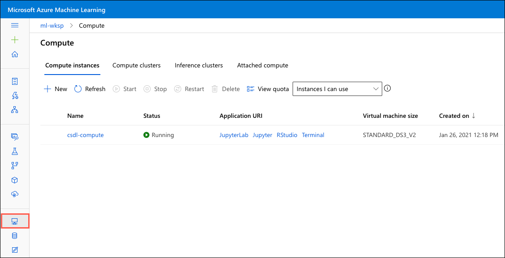
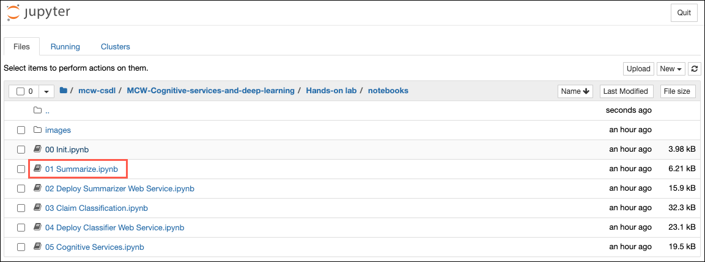
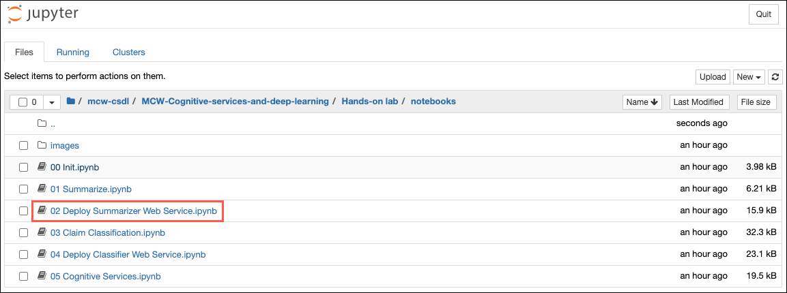
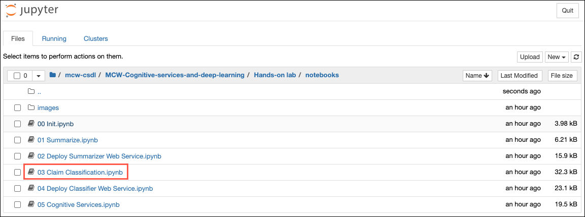
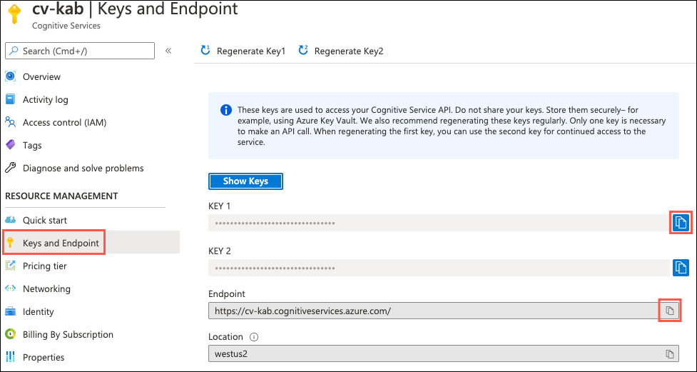
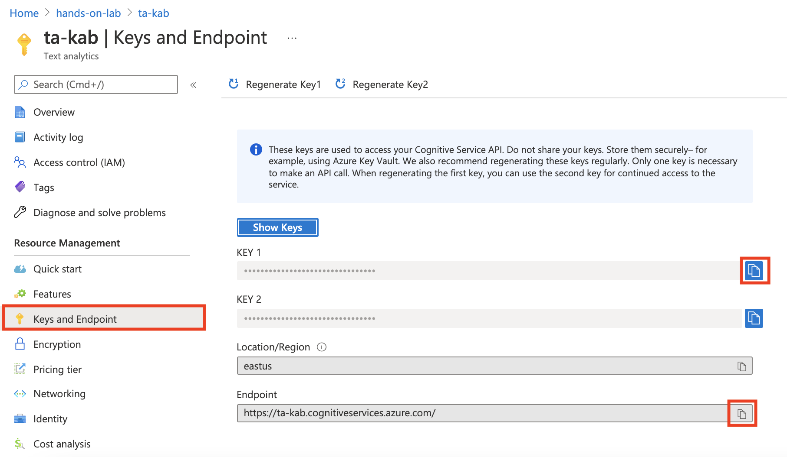
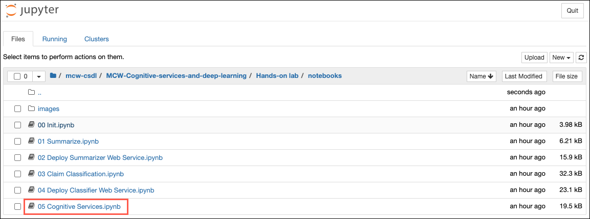

Cognitive services and deep learning

Hands-on lab step-by-step

January 2021

Information in this document, including URL and other Internet Web site references, is subject to change without notice. Unless otherwise noted, the example companies, organizations, products, domain names, e-mail addresses, logos, people, places, and events depicted herein are fictitious, and no association with any real company, organization, product, domain name, e-mail address, logo, person, place or event is intended or should be inferred. Complying with all applicable copyright laws is the responsibility of the user. Without limiting the rights under copyright, no part of this document may be reproduced, stored in or introduced into a retrieval system, or transmitted in any form or by any means (electronic, mechanical, photocopying, recording, or otherwise), or for any purpose, without the express written permission of Microsoft Corporation.

Microsoft may have patents, patent applications, trademarks, copyrights, or other intellectual property rights covering subject matter in this document. Except as expressly provided in any written license agreement from Microsoft, the furnishing of this document does not give you any license to these patents, trademarks, copyrights, or other intellectual property.

The names of manufacturers, products, or URLs are provided for informational purposes only, and Microsoft makes no representations and warranties, either expressed, implied, or statutory, regarding these manufacturers or the use of the products with any Microsoft technologies. The inclusion of a manufacturer or product does not imply endorsement of Microsoft of the manufacturer or product. Links may be provided to third-party sites. Such sites are not under the control of Microsoft and Microsoft is not responsible for the contents of any linked site or any link contained in a linked site, or any changes or updates to such sites. Microsoft is not responsible for webcasting or any other form of transmission received from any linked site. Microsoft is providing these links to you only as a convenience, and the inclusion of any link does not imply endorsement of Microsoft of the site or the products contained therein.

© 2021 Microsoft Corporation. All rights reserved.

Microsoft and the trademarks listed at <https://www.microsoft.com/en-us/legal/intellectualproperty/Trademarks/Usage/General.aspx> are trademarks of the Microsoft group of companies. All other trademarks are the property of their respective owners.

**Contents**

- [Cognitive services and deep learning hands-on lab step-by-step](#cognitive-services-and-deep-learning-hands-on-lab-step-by-step)
  - [Abstract and learning objectives](#abstract-and-learning-objectives)
  - [Overview](#overview)
  - [Solution architecture](#solution-architecture)
  - [Requirements](#requirements)
  - [Exercise 1: Locate the Lab Notebooks](#exercise-1-locate-the-lab-notebooks)
    - [Task 1: Open the notebooks folder](#task-1-open-the-notebooks-folder)
  - [Exercise 2: Create and Deploy an Unsupervised Model](#exercise-2-create-and-deploy-an-unsupervised-model)
    - [Task 1: Install libraries](#task-1-install-libraries)
    - [Task 2: Read through and execute the Summarization notebook](#task-2-read-through-and-execute-the-summarization-notebook)
    - [Task 3: Provision the Azure Machine Learning Workspace and Create the Summarization service](#task-3-provision-the-azure-machine-learning-workspace-and-create-the-summarization-service)
  - [Exercise 3: Create and Deploy a Keras Model](#exercise-3-create-and-deploy-a-keras-model)
    - [Task 1: Create a simple Keras based model](#task-1-create-a-simple-keras-based-model)
    - [Task 2: Deploy the Keras model](#task-2-deploy-the-keras-model)
  - [Exercise 4: Completing the solution](#exercise-4-completing-the-solution)
    - [Task 1: Retrieve the Computer Vision API endpoint and key](#task-1-retrieve-the-computer-vision-api-endpoint-and-key)
    - [Task 2: Retrieve the Text Analytics API endpoint and key](#task-2-retrieve-the-text-analytics-api-endpoint-and-key)
    - [Task 3: Completing the solution](#task-3-completing-the-solution)
  - [After the hands-on lab](#after-the-hands-on-lab)
    - [Task 1: Clean up lab resources](#task-1-clean-up-lab-resources)

# Cognitive services and deep learning hands-on lab step-by-step

## Abstract and learning objectives

In this hands-on lab, you implement a solution that combines both pre-built artificial intelligence (AI) in the form of various Cognitive Services with custom AI in the form of services built and deployed with Azure Machine Learning service. In the lab, you work with unstructured text and image data and learning how to develop analytics pipelines for various problems such as text summarization, text classification, image detection, optical character recognition (OCR), and sentiment analysis. You learn how to build and train a deep neural net for text classification. You also learn how to deploy multiple kinds of predictive services using Azure Machine Learning and learn to integrate with the Computer Vision API and the Text Analytics API from Cognitive Services.

At the end of this hands-on lab, you will be better able to present solutions leveraging Azure Machine Learning service, Azure Machine Learning compute instance, and Cognitive Services.

## Overview

In this workshop, you help Contoso Ltd. build a proof of concept that shows how they can develop a solution that amplifies their agents' claims processing capabilities.

## Solution architecture

The high-level architecture of the solution is illustrated in the diagram. The lab is performed within the context of a notebook running within Azure Machine Learning compute instance. Various notebooks are built to test the integration with the Cognitive Services listed, train custom ML services, and integrate the results in a simple user interface that shows the effect of processing the claim with all of the AI services involved.

## Requirements

1. Microsoft Azure subscription must be pay-as-you-go or MSDN.

    - Trial subscriptions will not work. You will run into issues with Azure resource quota limits.
    - Subscriptions with access limited to a single resource group will not work. You will need the ability to deploy multiple resource groups.

## Exercise 1: Locate the Lab Notebooks

Duration: 5 minutes

In this exercise, you will navigate to the folder where all the notebooks for this lab are available.

### Task 1: Open the notebooks folder

1. From within Azure Machine Learning studio, navigate to the `Compute` section by selecting it from the left-hand navigation menu.

    

2. Select the **Jupyter** link associated with your compute instance, **csdl-compute-SUFFIX** to open the Jupyter Notebooks interface.

   

3. Navigate to the `> mcw-csdl > MCW-Cognitive-services-and-deep-learning > Hands-on lab > notebooks` folder where you will find all your lab notebooks.

    

## Exercise 2: Create and Deploy an Unsupervised Model

Duration: 60 minutes

In this exercise, you create and deploy a web service that uses a pre-trained model to summarize long text paragraphs.

### Task 1: Install libraries

The notebooks you use throughout this hands-on lab depend on specific Python libraries like Keras and TensorFlow. The following steps walk you through adding these dependencies.

1. Within the `notebooks` folder on the Jupyter interface, select the notebook named `00 init.ipynb`. This link opens the notebook so you can read and execute the code it contains.

    

2. Run each cell in the notebook to install the required libraries.

### Task 2: Read through and execute the Summarization notebook

1. Within the `notebooks` folder on the Jupyter interface, select the notebook named `01 Summarize.ipynb`. This link opens the notebook so you can read and execute the code it contains.

    

2. Read the instructions at the top of the notebook, and execute the cells as instructed.

    > **Note**: Make sure you copy the scoring URI from the output of the last cell of this notebook. The scoring URI value is needed in the final notebook of this hands-on lab.

### Task 3: Provision the Azure Machine Learning Workspace and Create the Summarization service

1. Within the `notebooks` folder on the Jupyter interface, select the notebook called `02 Deploy Summarizer Web Service.ipynb`. This link opens the notebook so you can read and execute the code it contains.

    

2. Read the instructions at the top of the notebook, provide the necessary values indicated in the instructions, and execute the cells as instructed.

## Exercise 3: Create and Deploy a Keras Model

Duration: 60 minutes

In this exercise, you use Keras to construct and train a Deep Neural Network (DNN) called the Long Short-Term Memory (LSTM) recurrent neural network. LSTM works well for text classification problems, especially when used in conjunction with word embedding such as GloVe for word vectorization. In this notebook, you also learn how GloVe word embeddings perform on word analogy tasks.

### Task 1: Create a simple Keras based model

1. Within the `notebooks` folder on the Jupyter interface, select the notebook named `03 Claim Classification.ipynb`. This link opens the notebook so you can read and execute the code it contains.

    

2. Read the instructions at the top of the notebook, and execute the cells as instructed.

   > **Note**: Pay attention to the top of the notebook and check the TensorFlow and Keras library versions. The TensorFlow version should be 2.0.0, and the Keras version should be 2.3.1.

### Task 2: Deploy the Keras model

1. Within the `notebooks` folder on the Jupyter interface, select the notebook named `04 Deploy Classifier Web Service.ipynb`. This link opens the notebook so you can read and execute the code it contains.

    

2. Read the instructions at the top of the notebook, and execute the cells as instructed.

    > **Note**: Make sure you copy the scoring URI from the output of the last cell of this notebook. The scoring URI value is needed in the final notebook of this hands-on lab.

## Exercise 4: Completing the solution

Duration: 45 minutes

In this exercise, you perform the final integration with the Computer Vision and Text Analytics APIs and the Azure Machine Learning service you previously deployed to deliver the completed proof of concept solution.

### Task 1: Retrieve the Computer Vision API endpoint and key

In this task, you retrieve the API key and endpoint URI associated with your Computer Vision API.

1. In the [Azure portal](https://portal.azure.com), select **Resource groups** from the Azure services list.

   

2. Select the `hands-on-lab-SUFFIX` resource group you created for this hands-on lab from the list of resource groups.

    

3. Select your Computer Vision Cognitive Services resource from the list.

    

4. Select **Keys and Endpoint** from the left-hand navigation menu and then copy the **Key 1** and **Endpoint** values into a text editor, such as Notepad.exe, or something similar as you will need this value later in this exercise.

    

### Task 2: Retrieve the Text Analytics API endpoint and key

In this task, you will retrieve the API key and endpoint URI associated with your Text Analytics API.

1. In the [Azure portal](https://portal.azure.com), select **Resource groups** from the Azure services list.

   

2. Select the `hands-on-lab-SUFFIX` resource group you created for this hands-on lab from the list of resource groups.

    

3. Select your Text Analytics Cognitive Services resource from the list.

    

4. Select **Keys and Endpoint** from the left-hand navigation menu and then copy the **Key 1** and **Endpoint** values into a text editor, such as Notepad.exe, or something similar as you will need this value later in this exercise.

    

### Task 3: Completing the solution

1. Return to the Azure Machine Learning Studio window. Within the `notebooks` folder on the Jupyter interface, select the notebook named `05 Cognitive Services.ipynb`. This link opens the notebook so you can read and execute the code it contains.

    

2. Follow the steps within the notebook to complete the lab and view the result of combining Cognitive Services with your Azure Machine Learning Services.

## After the hands-on lab

Duration: 5 minutes

To avoid unexpected charges, it is recommended that you clean up all of your lab resources when you complete the lab.

### Task 1: Clean up lab resources

1. In the [Azure portal](https://portal.azure.com), select **Resource groups** from the Azure services list.

   

2. Select the `hands-on-lab-SUFFIX` resource group you created for this hands-on lab from the list of resource groups.

    

3. Select **Delete resource group** from the command bar.

    

4. In the confirmation dialog that appears, enter the name of the resource group and select **Delete**.

5. Wait for the confirmation that the Resource Group has been successfully deleted. If you don't wait, and the delete fails for some reason, you may be left with resources running that were not expected. You can monitor using the Notifications dialog, which is accessible from the Alarm icon.

    

6. When the Notification indicates success, the cleanup is complete.

You should follow all steps provided _after_ attending the Hands-on lab.
