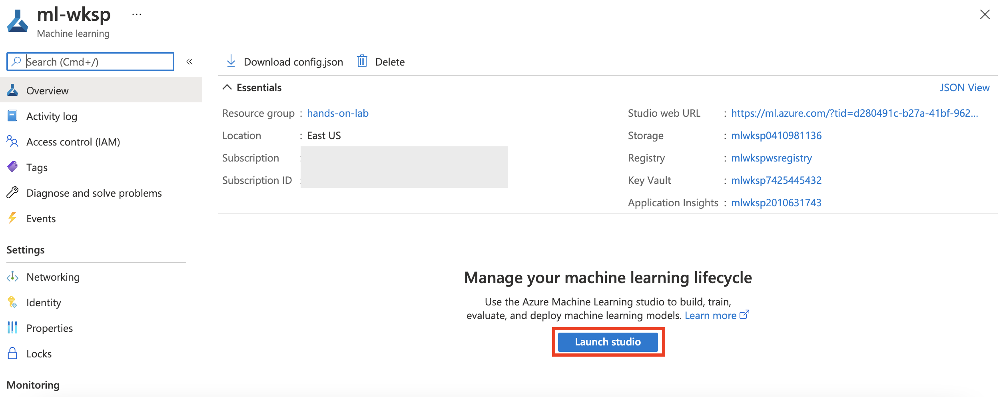

## **Getting Started**

1. Open the Azure Portal from the Desktop and login to Azure with the below Azure Username and Password

   * **Azure Usename/Email**:  <inject key="AzureAdUserEmail"></inject>
   * **Azure Password**:  <inject key="AzureAdUserPassword"></inject>

2. If you see the pop-up  **Stay Signed in?**, click **No**

3. If you see the pop-up **You have free Azure Advisor recommendations!** , close the window to continue the lab. 

4. If a **Welcome to Microsoft Azure** popup window appears, click **Maybe Later** to skip the tour.

### Task 1: Import the lab notebooks

In this task, you import Jupyter notebooks from GitHub that you will use to complete the exercises in this hands-on lab.

1. Navigate to **mcwailab-SUFFIX** resource group and select the Machine Learning workspace named <inject key="AML Workspace Name"></inject>.

1. Select the **Overview** from the Machine Learning workspace navigation menu and click on **Launch now** under **Manage your machine learning lifecycle** to launch the workspace.

   

1. Select the Compute Instance, **csdl-compute-SUFFIX**, and then select **Jupyter** link to open Jupyter Notebooks interface.

   

1. Check **Yes, I understand** and select **Continue** in the trusted code dialog.

   

1. In the new Jupyter window, select **New** and then select **Terminal** from the context menu.

   
  
1. Run the following commands in order in the terminal window:

   - `mkdir mcw-csdl`
   - `cd mcw-csdl`
   - `git clone https://github.com/microsoft/MCW-Analyzing-text-with-azure-machine-learning-and-cognitive-services.git`

5. Wait for the `clone` command to finish importing the repo.

### Task 2: Setup lab environment

1. From the terminal window run the following commands (assuming you are in the `mcw-csdl` folder):

   - `cd "MCW-Analyzing-text-with-azure-machine-learning-and-cognitive-services/Hands-on lab/notebooks"`
   - `conda activate azureml_py38`
   - `pip install --upgrade pip`
   - `pip install -r requirements.txt`
   - `pip install ipykernel==6.6.0`

> Note: You can safely ignore any dependency errors during installation and re-run the commands.

You should follow all these steps provided *before* attending the Hands-on lab.
